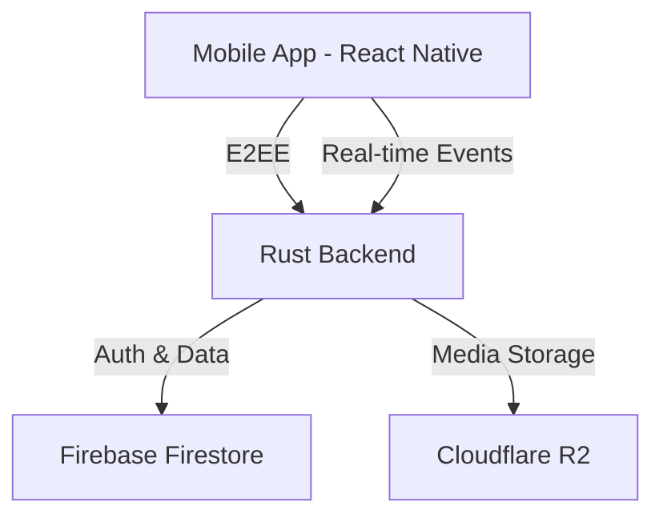

# Fluxenite Chat

[](https://opensource.org/licenses/MIT)
[](https://www.typescriptlang.org/)
[](https://www.rust-lang.org/)

**Fluxenite Chat** is a high-performance, end-to-end encrypted (E2EE) mobile
messaging application built with React Native and a robust Rust-based backend.
Designed with security and speed in mind, it provides a seamless and private
communication experience.

## 🚀 Key Features

- **End-to-End Encryption (E2EE):** All messages are encrypted locally on the
  device using TweetNaCl before being sent.
- **Real-time Messaging:** High-speed delivery via WebSockets with automatic
  reconnection.
- **Modern UI/UX:** A clean, dark-themed interface built with a disciplined
  design system.
- **Scalable Backend:** A high-concurrency Rust server utilizing Firebase
  Firestore and Cloudflare R2 for media storage.
- **Media Support:** Securely upload and share images and files.
- **Presence & Typing:** Real-time online status and typing indicators.

## 🏗 Architecture



## 🛠 Tech Stack

- **Mobile:** React Native, TypeScript, Zustand (State Management), React
  Navigation.
- **Backend:** Rust, Axum (Web Framework), Tokio (Async Runtime).
- **Security:** TweetNaCl (Encryption), JWT (Authentication).
- **Cloud:** Firebase (Firestore), Cloudflare (R2 Storage).

## 📥 Getting Started

### 1. Prerequisites

- [Node.js](https://nodejs.org/) (v18+)
- [Rust](https://www.rust-lang.org/tools/install) (latest stable)
- [Android Studio](https://developer.android.com/studio/index.html) / Xcode
  (for mobile development)

### 2. Backend Setup

```bash
cd backend
cp .env.example .env
# Fill in your .env with Firebase and R2 credentials
cargo run --release
```

### 3. Mobile Setup

```bash
cd mobile
npm install
npm run android # or npm run ios
```

## 🛡 Security

Messages are encrypted using `tweetnacl`. Private keys never leave the device.
For detailed security rules, refer to `docs/firestore-security-rules.md`.

## 📄 License

This project is licensed under the MIT License - see the [LICENSE](LICENSE)
file for details.
