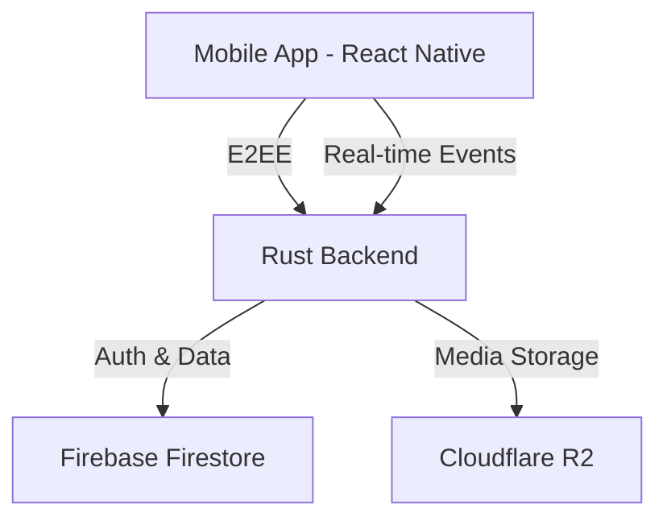

# ⚠️ Fluxenite Chat — No Longer Maintained

> **Maintenance has ended.** This project is no longer actively developed or supported. It is preserved for reference only.

---

# Fluxenite Chat

[](https://opensource.org/licenses/MIT)
[](https://www.typescriptlang.org/)
[](https://www.rust-lang.org/)

**Fluxenite Chat** is a high-performance, end-to-end encrypted (E2EE) mobile messaging application built with React Native and a Rust-based backend.

## 🚀 Key Features
- End-to-End Encryption (E2EE)
- Real-time Messaging
- Modern UI/UX
- Rust backend
- Media Support
- Presence & Typing

## 🏗 Architecture


## 🛠 Tech Stack
- React Native, TypeScript, Zustand, React Navigation
- Rust, Axum, Tokio
- TweetNaCl, JWT
- Firebase Firestore, Cloudflare R2

## 📥 Getting Started
### Backend
```bash
cd backend
cp .env.example .env
cargo run --release
```

### Mobile
```bash
cd mobile
npm install
npm run android
```

## 🛡 Security
Messages were designed to be encrypted using `tweetnacl`. Review the implementation carefully before relying on it for security-sensitive use.

## 📄 License
MIT
